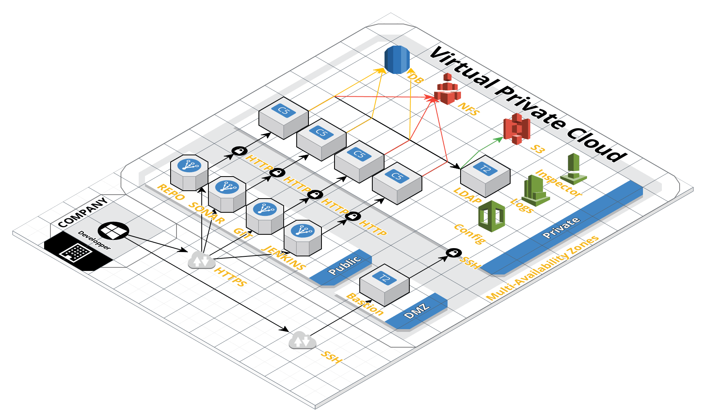

# A toolchain for the masses

## Description

These stack create a build toolchain based on 
1. [OpenLDAP](https://www.openldap.org/)
2. [Gitlab](https://about.gitlab.com/)
3. [Artifactory](https://jfrog.com/artifactory/)
4. [Sonarqube](https://www.sonarqube.org/)
5. [Jenkins](https://jenkins.io/)

All services are configured for Fault Tolerance (but not High Availability). It means that if an instance of one of the services happen to fail, another one will be immediately spun up.

Further, all the services are configured to:
1. Send Health Notification Alert to a predefined email in case of an AutoScaling event.
2. Install Security packages on an hourly basis.
3. Install Update on a daily basis.
4. Periodically run the [AWS Inspector](https://aws.amazon.com/inspector/) Agent to assess the Instance for vulnerability. It will try automatically remediate the CVE.
 


## Installation Guide

These templates should be launched in order. 

1. You must have previously run the [`01-vpc.yaml`](../) templates [](https://console.aws.amazon.com/cloudformation/home#/stacks/new?stackName=BUILD&templateURL=https://raw.githubusercontent.com/rostskadat/aws-cloudformation/master/stacks/01-vpc.yaml)

2. You must have previously run the [`mysql.yaml`](../db/mysql.yaml) templates [](https://console.aws.amazon.com/cloudformation/home#/stacks/new?stackName=BUILD-MYSQL&templateURL=https://raw.githubusercontent.com/rostskadat/aws-cloudformation/master/stacks/db/mysql.yaml) and the [`postgresql.yaml`](../db/postgresql.yaml) [](https://console.aws.amazon.com/cloudformation/home#/stacks/new?stackName=BUILD-POSTGRESQL&templateURL=https://raw.githubusercontent.com/rostskadat/aws-cloudformation/master/stacks/db/postgresql.yaml)

3. Launch the LDAP stack [](https://console.aws.amazon.com/cloudformation/home#/stacks/new?stackName=BUILD-OPENLDAP&templateURL=https://raw.githubusercontent.com/rostskadat/aws-cloudformation/master/stacks/01-openldap.yaml)

4. Then launch the Artifactory [](https://console.aws.amazon.com/cloudformation/home#/stacks/new?stackName=BUILD-ARTIFACTORY&templateURL=https://raw.githubusercontent.com/rostskadat/aws-cloudformation/master/stacks/02-artifactory.yaml)

5. Then launch the Gitlab [](https://console.aws.amazon.com/cloudformation/home#/stacks/new?stackName=BUILD-GITLAB&templateURL=https://raw.githubusercontent.com/rostskadat/aws-cloudformation/master/stacks/03-gitlab.yaml)

6. Then launch the SonarQube [](https://console.aws.amazon.com/cloudformation/home#/stacks/new?stackName=BUILD-SONARQUBE&templateURL=https://raw.githubusercontent.com/rostskadat/aws-cloudformation/master/stacks/04-sonarqube.yaml)

7. Then launch the Jenkins [](https://console.aws.amazon.com/cloudformation/home#/stacks/new?stackName=BUILD-JENKINS&templateURL=https://raw.githubusercontent.com/rostskadat/aws-cloudformation/master/stacks/05-jenkins.yaml)

# Ansible

All stacks are provisioned using [Ansible](https://www.ansible.com/). You can have a look at the different [playbooks](../../playbooks) 

# HOWTO connect to your JENKINS master from your corporate network

In your jumping host edit your `.ssh/config` to read:

```
Host aws-bastion
  HostName YOUR_PUBLIC_BASTION_DNS
  User ec2-user
  ProxyCommand /usr/bin/nc --proxy-type http --proxy proxy_hostname:3128 %h %p
  IdentityFile ~/.ssh/id_rsa
  ServerAliveInterval 300
  ServerAliveCountMax 2
```

Then launch the following commands: 

```
# First open the HTTP tunnel through your corporate proxy to the port of the public ELB (80/443)
jumping_host> ssh -CnfNL 4567:{{JenkinsDNSName}}:80 aws-bastion
# Then also open a tunnel toward the JNPL ELB
jumping_host> ssh -CnfNL 49817:{{JenkinsDNSNameJNPL}}:49817 aws-bastion
```

Then in your slave's `/etc/init.d/jenkins-swarm-client` make sure that you specify the `SWARM_MASTER` as  

```
SWARM_MASTER=http://jumping_host:4567
```

