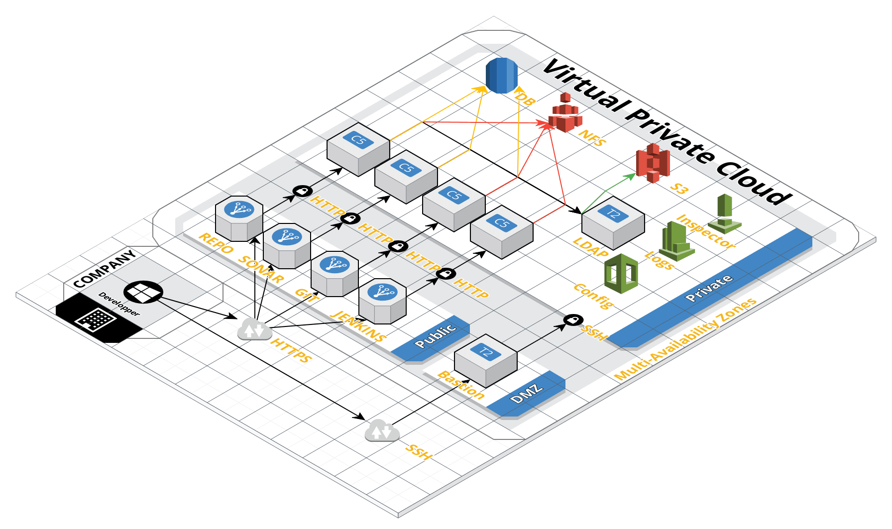

# HOWTO connect to your JENKINS master from your corporate network

In your jumping host edit your `.ssh/config` to read:

```
Host aws-bastion
  HostName YOUR_PUBLIC_BASTION_DNS
  User ec2-user
  ProxyCommand /usr/bin/nc --proxy-type http --proxy proxy_hostname:3128 %h %p
  IdentityFile ~/.ssh/id_rsa
  ServerAliveInterval 300
  ServerAliveCountMax 2

```

Then launch the following commands: 

```
# First open the HTTP tunnel through your corporate proxy to the port of the public ELB
jumping_host> ssh -CnfNL 4567:{{JenkinsDNSName}}:80 aws-bastion
# Then also open a tunnel toward the TCP ELB  
jumping_host> ssh -CnfNL 49817:{{JenkinsDNSNameJNPL}}:49817 aws-bastion
```

Then in your `/etc/init.d/jenkins-swarm-client` make sure that you specify the 

```
SWARM_MASTER=http://jumping_swarm:4567
```

